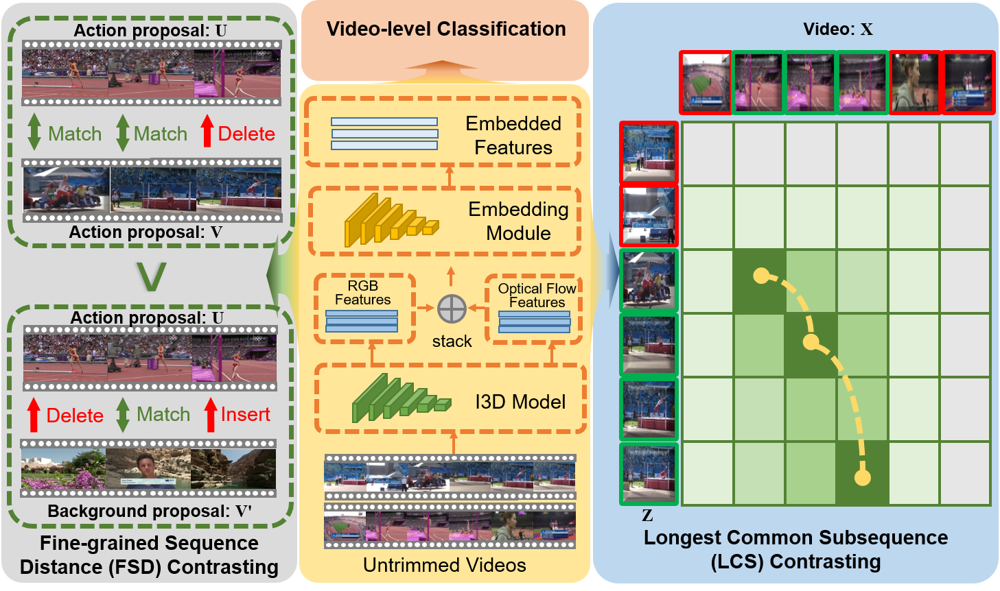

# Fine-grained Temporal Contrastive Learning for Weakly-supervised Temporal Action Localization
[Paper]()

Junyu Gao, Mengyuan Chen, Changsheng Xu

IEEE/CVF Conference on Computer Vision and Pattern Recognition (**CVPR**), 2022.


## Table of Contents
1. [Introduction](#introduction)
1. [Preparation](#preparation)
1. [Testing](#testing)
1. [Training](#training)
1. [Model](#model)
1. [Citation](#citation)

## Introduction
We target at the task of weakly-supervised action localization (WSAL), where only video-level action labels are available during model training. Despite the recent progress, existing methods mainly embrace a localization-by-classification paradigm and overlook the fruitful fine-grained temporal distinctions between video sequences, thus suffering from severe ambiguity in classification learning and classification-to-localization adaption. This paper argues that learning by contextually comparing sequence-to-sequence distinctions offers an essential inductive bias in WSAL and helps identify coherent action instances. Specifically, under a differentiable dynamic programming formulation, two complementary contrastive objectives are designed, including Fine-grained Sequence Distance (FSD) contrasting and Longest Common Subsequence (LCS) contrasting, where the first one considers the relations of various action/background proposals by using match, insert, and delete operators and the second one mines the longest common subsequences between two videos. Both contrasting modules can enhance each other and jointly enjoy the merits of discriminative action-background separation and alleviated task gap between classification and localization. Extensive experiments show that our method achieves state-of-the-art performance on three popular benchmarks.



## Preparation
### Requirements and Dependencies
Here we list our used requirements and dependencies.
 - Linux: Ubuntu 20.04 LTS
 - GPU: GeForce RTX 3090
 - CUDA: 11.1
 - Python: 3.7.11
 - PyTorch: 1.9.0
 - Numpy: 1.20.3
 - Pandas: 1.3.1
 - Scikit-learn: 0.24.2
 - Wandb: 0.11.1 

### THUMOS14 Dataset：

We use the 2048-d features provided by arXiv 2021 paper: ACM-Net Action Context Modeling Network for Weakly-Supervised Temporal Action Localization. You can get access of the THUMOS14 dataset from [Google Drive](https://drive.google.com/drive/folders/1C4YG01X9IIT1a568wMM8fgm4k4xTC2EQ?usp=sharing) /  [Baidu Wangpan](https://pan.baidu.com/s/1rt8szoDspzJ5SjpcjccFXg) (pwd: vc21).

## Testing

To test your model, you can run following command:

```bash
python main_thu.py --test --checkpoint $checkpoint_path
```

## Training

We utilize a pre-trained model produced by the backbone network [ACM-Net](https://github.com/ispc-lab/ACM-Net) to initialize our FTCL-Net. The ACM-Net can be accessed by running the following command:

```bash
python main_thu.py --group baseline --model_name acmnet --epochs 500
```

Note: According to our experiments, the training of ACM-Net is not very stable with different random seeds. Therefore, before training the FTCL network, it should be guaranteed that ACM-Net can achieve the result (42.6% mAP@Avg) reported in its paper under the current random seed.

Utilizing the trained ACM-Net model as the checkpoint, you can then train your own FTCL model by running:

```bash
python main_thu.py --group ftcl --model_name ftcl --checkpoint /path/to/THUMOS-14/save/baseline/acmnet/THUMOS_best.pth --ftcl
```

You can configure your own hyper-parameters in `config/model_config.py` .

Note that we apply the [`wandb`](https://github.com/wandb/client) client to log the experiments, if you don't want to use this tool, you can disable it in the command with   `--without_wandb` like 

```bash
python main_thu.py --ftcl --without_wandb
```

## Model

The pre-trained model (checkpoint) of our FTCL-Net for the THUMOS-14 dataset can be downloaded from the [Google Drive](https://drive.google.com/file/d/1DDPFx0lENZuwIsdP5abARc9FVEaWy1bV/view?usp=sharing).

## Citation
If you find the code useful in your research, please cite:

    @inproceedings{junyu2022CVPR_FTCL,
      author = "Gao, Junyu and Chen, Mengyuan and Xu, Changsheng",
      title = "Fine-grained Temporal Contrastive Learning for Weakly-supervised Temporal Action Localization",
      booktitle = "IEEE/CVF Conference on Computer Vision and Pattern Recognition (CVPR)",
      year = "2022"
    }

## License

See [MIT License](/LICENSE)

## Acknowledgement

This repo contains modified codes from:
 - [ACM-Net](https://github.com/ispc-lab/ACM-Net): for implementation of the backbone [ACM-Net (arXiv-2021)](https://arxiv.org/abs/2104.02967).
 - [VideoAlignment](https://github.com/hadjisma/VideoAlignment): for implementation of the smooth max operation.

We sincerely thank the owners of all these great repos!