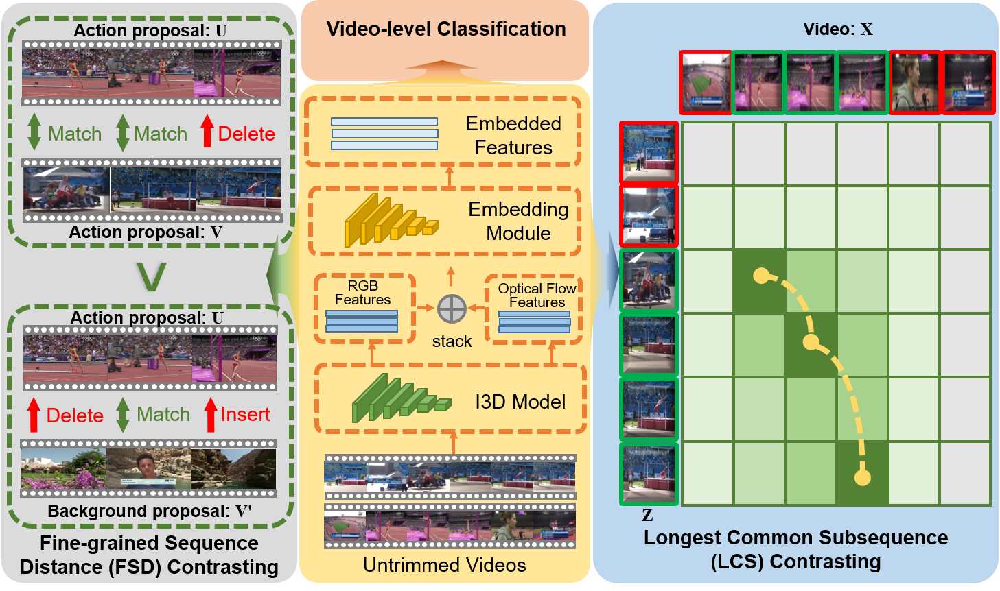

# Dual-Evidential Learning for Weakly-supervised Temporal Action Localization
[Paper]()

Mengyuan Chen, Junyu Gao, Shicai Yang, Changsheng Xu

European Conference on Computer Vision (**ECCV**), 2022.

## Table of Contents
1. [Introduction](#introduction)
1. [Preparation](#preparation)
1. [Testing](#testing)
1. [Training](#training)
1. [Citation](#citation)

## Introduction
Weakly-supervised temporal action localization (WS-TAL) aims to localize the action instances and recognize their categories with only video-level labels. Despite great progress, existing methods suffer from severe action-background ambiguity, which mainly comes from background noise introduced by aggregation operations and large intra-action variations caused by the task gap between classification and localization. To address this issue, we propose a generalized evidential deep learning (EDL) framework for WS-TAL, called Dual-Evidential Learning for Uncertainty modeling (DELU), which extends the traditional paradigm of EDL to adapt to the weakly-supervised multi-label classification goal. Specifically, targeting at adaptively excluding the undesirable background snippets, we utilize the video-level uncertainty to measure the interference of background noise to video-level prediction. Then, the snippet-level uncertainty is further induced for progressive learning, which gradually focuses on the entire action instances in an ``easy-to-hard'' manner. Extensive experiments show that DELU achieves state-of-the-art performance on THUMOS14 and ActivityNet1.2 benchmarks.



## Prerequisites
### Requirements and Dependencies:
Here we list our used requirements and dependencies.
 - Linux: Ubuntu 20.04 LTS
 - GPU: GeForce RTX 3090
 - CUDA: 11.1
 - Python: 3.7.11
 - PyTorch: 1.11.0
 - Numpy: 1.21.2
 - Pandas: 1.3.5
 - Scipy: 1.7.3 
 - Wandb: 0.12.11
 - Tqdm: 4.64.0

### THUMOS14 Dataset：
We use the 2048-d features provided by MM 2021 paper: Cross-modal Consensus Network for Weakly Supervised Temporal Action Localization. You can get access of the dataset from [here](https://rpi.app.box.com/s/hf6djlgs7vnl7a2oamjt0vkrig42pwho). The annotations are included within this package.

## Testing
Download the pretrained model: https://drive.google.com/file/d/1LrCIUZN101SzTqNdNqc_RSQq2zhrm2Ha/view?usp=sharing

Put our provided pretrained model best_DELU.pkl under the project folder, and run:

```
./test_thumos.sh
```

## Training
Change "path/to/thumos" into your own path to the dataset, and run:
```
./train_thumos.sh
```

## Citation
If you find the code useful in your research, please cite:

    @inproceedings{mengyuan2022ECCV_DELU,
      author = {Chen, Mengyuan and Gao, Junyu and Yang, Shicai and Xu, Changsheng},
      title = {Dual-Evidential Learning for Weakly-supervised Temporal Action Localization},
      booktitle = {European Conference on Computer Vision (ECCV)},
      year = {2022}
    }

## License

See [MIT License](/LICENSE)

## Acknowledgement

This repo contains modified codes from:
 - [MM2021-CO2-Net](https://github.com/harlanhong/MM2021-CO2-Net): for implementation of the backbone [CO2-Net (MM2021)](https://arxiv.org/abs/2107.12589).
 - [DEAR](https://github.com/Cogito2012/DEAR): for implementation of the EDL loss utilized in [DEAR](https://arxiv.org/abs/2107.10161).

We sincerely thank the owners of all these great repos!
